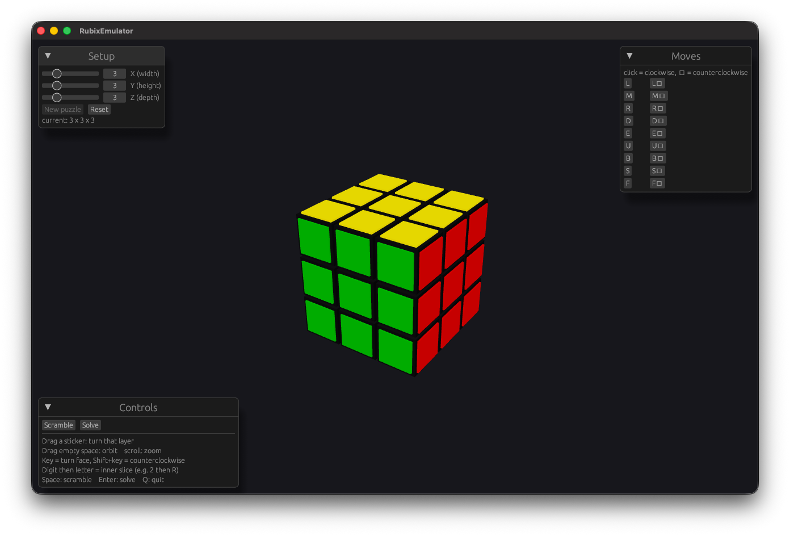

# RubixEmulator

A generic twisty-puzzle emulator, starting with rectangular box shapes (X × Y × Z, not necessarily equal), with the long-term goal of supporting arbitrary shapes (Pyraminx, etc.).

It ships with two interactive 3D renderers: a cross-platform GUI window (the default)
and a fallback that runs right in your terminal.



## Running it

```
cargo run              # GUI window, 3 × 3 × 3
cargo run -- 4 4 4     # GUI window, custom X Y Z dimensions
cargo run -- --tui     # terminal renderer instead
```

The three axes (X, Y, Z) are always set independently, so `3 × 3 × 5` is as valid
as `3 × 3 × 3`.

### GUI window (default)

Opens a `three-d` window (winit + OpenGL, builds unchanged on Windows, macOS, and
Linux) showing the solved puzzle, with an `egui` overlay of three panels:

- **Setup** — sliders for X / Y / Z (1–10 pieces per axis); "New puzzle" rebuilds at
  that size, "Reset" restores the current size to solved.
- **Moves** — a button per legal move: click for clockwise, the `′` button for
  counterclockwise.
- **Controls** — "Scramble" / "Solve" buttons plus the input reference below.

| Input | Action |
| --- | --- |
| Drag empty space | Orbit the camera |
| Scroll | Zoom in / out |
| Drag a sticker | Turn that sticker's layer in the drag direction |
| A letter (`r`, `u`, `f`, `l`, `d`, `b`, ...) | Turn the matching face clockwise |
| Shift + letter | Turn the matching face counterclockwise |
| A digit (`2`–`9`) then a letter | Turn an inner slice that many layers in, e.g. `2` then `r` for `2R` |
| Space | Scramble (25 random moves) |
| Enter | Solve (undo everything back to solved) |
| `q` / `Esc` | Quit |

A single layer turn is animated; scramble and solve snap.

### Terminal renderer (`--tui`)

Starts with a small setup screen for choosing the puzzle's size, then opens an
interactive isometric view rendered with half-block characters.

**Setup screen:**

| Key | Action |
| --- | --- |
| Up / Down | Pick which axis to change |
| Left / Right, or a digit `1`–`9` | Change the selected axis (1–10 pieces) |
| Enter | Start the puzzle at that size |
| `q` / `Esc` | Quit |

**Controls:** same keys as the GUI window (arrow keys orbit, `+` / `-` zoom).

> **Note:** the terminal renderer is an interactive terminal program — run it from a
> real terminal (the integrated terminal, or the "Debug RubixEmulator" launch config).
> VS Code's build/run *task* output panel isn't a TTY, so keystrokes won't reach it.

Face letters follow standard cube notation (`R`/`L`, `U`/`D`, `F`/`B`), with wide-move numbering and `M`/`E`/`S` slice names where they apply — see [Architecture](#architecture) below.

## Commands

- Build: `cargo build`
- Run: `cargo run`
- Test (all): `cargo test`
- Test (single): `cargo test <test_name>` (e.g. `cargo test move_only_touches_its_own_layer`)

## Architecture

**Piece-based, not face-based.** The puzzle is never modeled as 6 independent `Side` objects. A face turn mutates 4 neighboring sides, and if sides own state independently that coupling gets messy and shape-specific fast. Instead, individual pieces (cubies) are the source of truth: each has a `position` and a map of which `Color` currently faces which `Direction`. A face is never stored — it's a derived view (`Rubix::face`) that filters pieces for a sticker facing that direction. This means a rotation can never leave faces inconsistent, because there's nothing to keep in sync.

**Geometry is behind a `Shape` trait**, so the rotation engine itself is shape-agnostic:
- `Shape::solved_pieces() -> Vec<Piece>` — the shape's solved layout.
- `Shape::moves() -> Vec<Move>` — its legal twists, each just `{ name: String, axis: Vec3, angle_degrees: f64, selector: Fn(&Piece) -> bool }`.
- `Cuboid` (`src/shapes/cuboid.rs`) is the only `Shape` implemented so far. A future `Pyramid` shape would implement the same trait — different piece generation, different moves (120° corner-tip twists instead of 90° layer twists) — without touching `Piece`, `Vec3`, or the rotation engine at all.

**`Rubix`** (`src/rubix.rs`) is the puzzle engine, generic over any `Shape`. Deliberately not named `Cube` — it gets its shape from whatever `Shape` is plugged in, rather than being cube-specific. Its core operation, `rotate(selector, axis, angle_degrees)`, spins any subset of pieces around any axis by any angle using a real rotation matrix (Rodrigues' formula, in `Vec3::rotate_about`). A box's ordinary 90°/layer moves (`Cuboid::moves`) are just one specific way of using that generic primitive — the engine doesn't know or care that it's a box.

**Positions and directions are `Vec3` (floats), not an integer grid.** This is what lets the same types eventually carry non-lattice-aligned shapes (e.g. a Pyraminx's vertices). Floating-point rotation accumulates rounding error over repeated moves, so every rotation result is snapped to the nearest lattice point (`Vec3::snapped_to_lattice`) immediately after. Since `f64` isn't `Hash`/`Eq`, sticker-direction map keys use `LatticeKey` (`src/vec3.rs`) — an exact `(i64, i64, i64)` built from an already-snapped `Vec3`.

Each `Cuboid` layer's own rotation axis must pass through that layer's own center, not just the world origin — so pieces sit on a lattice centered on the cube's own middle (`Cuboid::centered_lattice_coord`), doubled in spacing so it stays integer-valued for even dimensions too.

**`Cuboid`, not `Box`**, for the box shape's name — `Box` would collide with Rust's own `std::Box` pointer type (which the codebase also uses, e.g. `Rubix { shape: Box<dyn Shape> }`).

**`Cuboid::moves()` names each move with standard cube notation** (`R`/`L`, `U`/`D`, `F`/`B` for outer layers; `2R`/`3R`/... counting depth in from a face for wider cubes; `M`/`E`/`S` for the exact middle layer only when that axis's dimension is exactly 3). This is a label on `Move`, not a notation parser — there's still no string-to-move parsing (e.g. "R U R'").

**Both renderers are pure consumers of the engine**, kept out of `Rubix`/`Shape`/`Piece` entirely. `src/render/` reads `Rubix::pieces()`/`Rubix::moves()`/`Rubix::apply()`/`scramble()`/`solve()` and nothing else. Code shared by both lives at the top of `src/render/` (`geometry.rs` for cubie/sticker geometry, `rng.rs` for a small xorshift RNG).

*Terminal renderer* (`src/render/terminal/`):
- `camera.rs` — a simple orbiting camera (azimuth/elevation/zoom), reusing `Vec3::rotate_about`.
- `projection.rs` — isometric 3D→2D projection. Every sticker face (all 6 sides of every piece, always) gets projected, plus a full-size opaque "plastic body" backing behind it, so gaps between inset stickers never show through to hidden geometry.
- `setup.rs` — the pre-launch size picker; runs under the same raw-mode guard as the render loop so input handling is consistent throughout.
- `input.rs` / `raster.rs` — crossterm-based raw-mode I/O and the input loop, and the rasterizer. Visibility is resolved with a true per-pixel depth buffer (not draw order): since each projected quad is a planar parallelogram under orthographic projection, both screen position and depth are exact affine functions of its two local axes, so a single 2×2 solve at rasterization time recovers correct containment and depth together. Rendering uses the half-block character trick (`▀` with distinct foreground/background colors) to roughly double effective vertical resolution.

*GUI window renderer* (`src/render/window/`), built on `three-d` (winit + OpenGL/WebGL). `mod.rs` owns the per-session state and per-frame pipeline (draw GUI → read input into one `Action` → apply → advance animation → render); the rest is split by concern:
- `scene.rs` — builds the drawable scene: one black plastic cube per cubie with a slightly raised colored tile on each stickered face.
- `panels.rs` — the `egui` overlay (Setup / Moves / Controls). A panel only ever produces an `Action`; it never touches the puzzle.
- `input.rs` — keyboard handling, including the digit-then-letter inner-slice prefix.
- `drag.rs` — resolves a mouse drag on a sticker into a specific layer turn and direction.
- `animation.rs` — animates a single layer turn; scramble/solve just rebuild the scene.

## Module layout

- `src/vec3.rs` — `Vec3`, `LatticeKey`, the `direction` module (6 axis-aligned unit vectors), rotation math, lattice snapping.
- `src/piece.rs` — `Piece`, `Color`.
- `src/shape.rs` — `Shape` trait, `Move` struct.
- `src/shapes/cuboid.rs` — `Cuboid`, the box shape's `impl Shape`.
- `src/rubix.rs` — `Rubix`: the puzzle engine (`solved`, `rotate`, `apply`, `face`).
- `src/render/` — both renderers, consumers of `Rubix`'s public API only:
  - `geometry.rs`, `rng.rs` — shared geometry and RNG.
  - `terminal/` — the terminal renderer (`setup.rs` size picker, `camera.rs`, `projection.rs`, `input.rs`, `raster.rs`).
  - `window/` — the `three-d` GUI window (`scene.rs`, `panels.rs`, `input.rs`, `drag.rs`, `animation.rs`).
- `tests/rubix_tests.rs` — integration tests for the engine.
- `tests/render_projection_tests.rs` — integration tests for the renderer's pure camera/projection math.

## Scope so far

The state model, rotation engine, and two interactive renderers (a `three-d` GUI window and a terminal renderer) exist for `Cuboid` shapes. Not yet implemented: a move-notation parser (e.g. "R U R'"), a real solver (`solve` just replays the move history in reverse), or additional shapes (Pyraminx, etc.). Colors are a fixed placeholder mapping (`+X` red, `-X` orange, `+Y` yellow, `-Y` white, `+Z` green, `-Z` blue) — not yet configurable.
